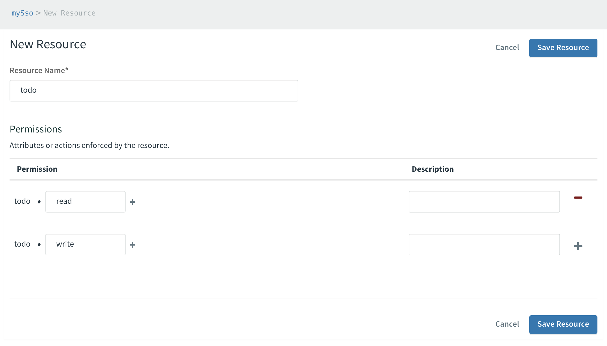
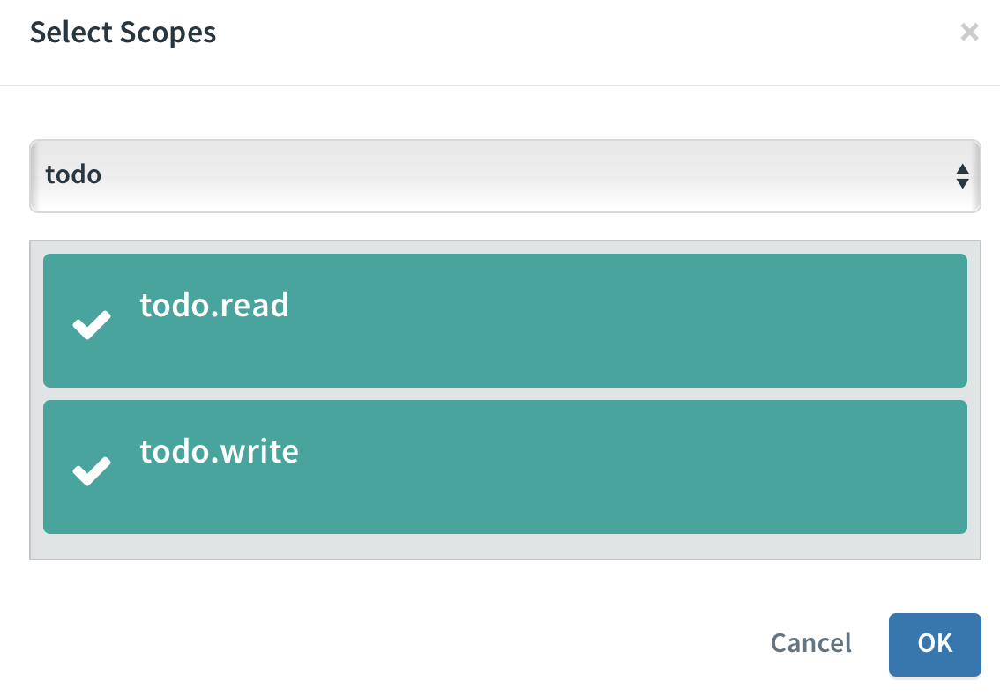

# Spring Boot OAUTH 2.0 Resource Server example with the PCF SSO Tile for Authentication 

For simplicity using the client_credentials grant type.

## Configuration of the Authorization Server (in PCF)

### 1. Ensure the *Single Sign-On* Service is available in your CF marketplace. 

This can be checked either with:

```bash
cf marketplace
```

(look for the p_identity service name). 

Or via the PCF GUI Services section (Single Sign-On).

### 2. Add this Single Sign-On service to your space

Give it any name.  

### 3. Add a Resource and Permissions 

Select your Service in the PCF GUI and click on the manage button.

Select the Resources Tab and click on New Resource. 

Create some sample permissions, example: 



Save the Resource. 

### 4. Add an App 

Select the Apps Tab and click New App.

Give it any name. 

Ensure you select *Service-to-Service* for Application Type.

Give it scope access to your created resource by clicking on the Scope Access and check marking all created scopes for your Resource.



Create the App. 

**Make sure to note the:**
1. App ID
2. App Secret
3. OAuth Token URL
4. OAuth Token Verification Keys URL

### 5. Verify you can create Bearer Tokens for your newly created Application. 

Note - replace OAUTH_TOKEN_URL, APP_ID, and APP_SECRET with your values.

```bash
curl -X POST OAUTH_TOKEN_URL -u "APP_ID:APP_SECRET" -d "grant_type=client_credentials" 

```

You should see a valid response with a bearer token and available scopes.

## Creating the Spring Boot OAUTH 2 Resource Server 

### 1. Using the Spring INITIALIZR website create a new template project with the Cloud OAuth2 and Web dependency.

>> Note - Client Credentials GrantType was introduced in Spring Security 5.1 

https://docs.spring.io/spring-security/site/docs/5.1.2.BUILD-SNAPSHOT/reference/htmlsingle/#new

### 2. Add a Sample WebController class with different permission (scope) requirements.

Note that resource names / scope needs to align with what you configured in the SSO tile. 

```java
@RestController
public class WebController {

    @RequestMapping("/")
    @PreAuthorize("permitAll")
    public String helloWorld(){
        return "Helloworld !!";
    }

    @RequestMapping("/read")
    @PreAuthorize("#oauth2.hasScope('todo.read')")
    public String readMethod(){
        return "Made some read to todo list.";
    }

    @RequestMapping("/write")
    @PreAuthorize("#oauth2.hasScope('todo.write')")
    public String writeMethod(){
        return "Made some write to todo list.";
    }

    @RequestMapping("/admin")
    @PreAuthorize("#oauth2.hasScope('todo.admin')")
    public String adminMethod(){
        return "Made some admin call to todo list.";
    }
}


```

You will also need to add the EnableResourceServer annotation as well as enable PreAuthorize annotations to your application.

```java
@SpringBootApplication
@EnableResourceServer
@EnableGlobalMethodSecurity(prePostEnabled = true)
public class PcfSsoResourceExampleApplication {
```

You 
```properties
security.oauth2.resource.jwt.key-uri=OAUTH_TOKEN_VERIFICATION_URL
```

### 3. Deploy your Application in PCF


### 4. Verify you can make secure SSO calls to your application using the earlier generated Bearer Token.


